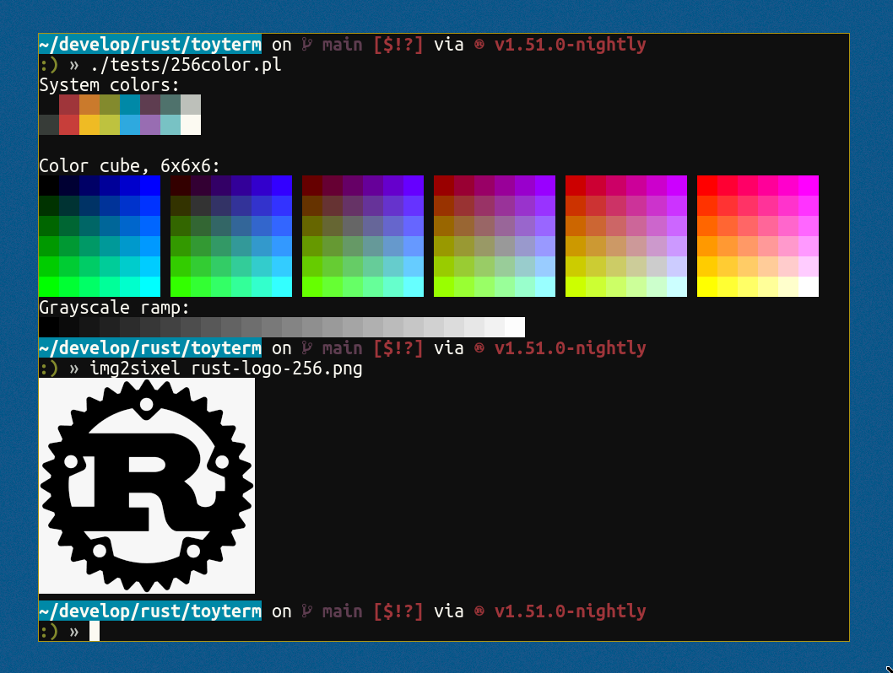

# toyterm

toyterm is a toy terminal emulator.

## Demo




## Features

- on Linux
    - it uses some Linux specific system calls
- written in Rust
- SDL2 (rendering)
- partially support VT100's control sequences
- 24bit color support


## Usage

### 1. Register terminfo

run following commands

```sh
$ tic -o ${HOME}/.terminfo/ src/toyterm.info
```

When you want to uninstall, please simply remove `${HOME}/.terminfo/t/toyterm-256color`.

### 2. Edit `settings.toml`

```toml
[font]
regular = "monospace" # font-family to use as the regular font
bold = "monospace" # font-family to use as bold font
size = 24  # glyph height (in pixel)
```

**Only monospaced fonts are supported currently.**

### 3. Run

```sh
$ cargo run --release
```

## Functions

### escape sequences

see `src/terminal/control.rs` and `src/toyterm.info`