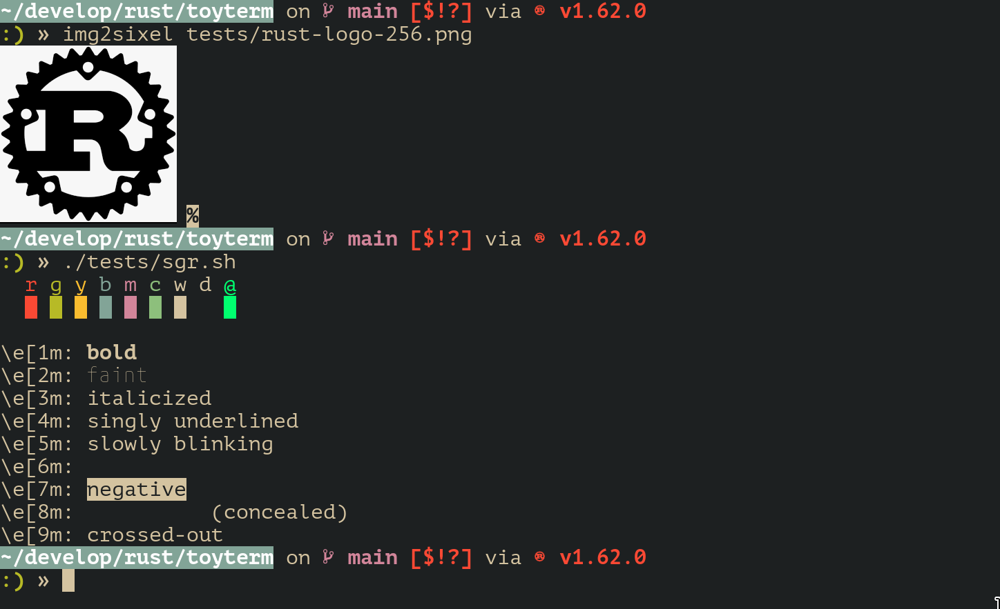

# toyterm

toyterm is a toy terminal emulator.



## Features/Limitations

- hardware accelerated graphics
- support for SIXEL graphics
- support for X11 clipboard (copying & pasting)
- (optional) support for multiplexing
- manual font fallback: you can specify the order of fonts for each style
- toyterm assumes UTF-8 encoding
- following basic functions are TODO
    - automatic font selection by integrating with fontconfig

## Usage

To install:
```sh
$ git clone https://github.com/algon-320/toyterm
$ cd toyterm
$ tic -x -o "$HOME/.terminfo/" toyterm.info
$ cargo install --path .
```
To enable multiplexing feature, please add "--features multiplex" to the last line.

To configure:
```sh
$ mkdir -p "$HOME/.config/toyterm"
$ cp ./config.toml "$HOME/.config/toyterm"
$ $EDITOR "$HOME/.config/toyterm/config.toml"
```

To uninstall:
```sh
$ rm "$HOME/.terminfo/t/toyterm-256color"
$ cargo uninstall toyterm
$ rm -r "$HOME/.config/toyterm"
```

## Keybinding

|Key|Function|
|:----------|:-------|
|Ctrl + `-` |Decrease font size|
|Ctrl + `=` |Increase font size|
|Ctrl + Shift + `c` |Copy selected text|
|Ctrl + Shift + `v` |Paste clipboard text|
|Ctrl + Shift + `l` |Clear history|
|Up key|Send `\x1b[[A`|
|Down key|Send `\x1b[[B`|
|Right key|Send `\x1b[[C`|
|Left key|Send `\x1b[[D`|
|PageUp key|Send `\x1b[5~`|
|PageDown key|Send `\x1b[6~`|
|Delete key|Send `\x1b[3~`|
|Backspace key|Send `\x7f`|
|Mouse Wheel|Same effect as arrow keys (Up/Down/Right/Left)|
|Shift + Mouse Wheel|Scroll history|

If feature `multiplex` is enalbed:
|Key|Function|
|:---------------|:-------|
|Ctrl + `a`, `c` |Create a new window|
|Ctrl + `a`, `n` |Switch to next window|
|Ctrl + `a`, `p` |Switch to prev window|
|Ctrl + `a`, Ctrl + `a` |Send `\x01` (Ctrl + `a`)|

## Control Functions

toyterm aims to support the standard control functions described in
[ECMA-48](https://www.ecma-international.org/publications-and-standards/standards/ecma-48/).
Some private functions, widely used by modern terminals, may be supported as well.
Currently toyterm supports the following functions.

### C0 functions

- BS
- CR
- ESC
- FF
- HT
- LF
- VT

### C1 functions

- CSI

### Control Sequences

- CHA
- CUB
- CUD
- CUF
- CUP
- CUU
- DCH
- DL
- DSR
- ECH
- ED
- EL
- HVP
- ICH
- IL
- RM
- SGR
    - Default: `\e[0m`, `\e[m`
    - Bold: `\e[1m`
    - Faint: `\e[2m`
    - Blinking (slow): `\e[5m`
    - Blinking (rapid): `\e[6m`
    - Negative: `\e[7m`
    - Consealed: `\e[8m`
    - Foreground Black: `\e[30m`
    - Foreground Red: `\e[31m`
    - Foreground Green: `\e[32m`
    - Foreground Yellow: `\e[33m`
    - Foreground Blue: `\e[34m`
    - Foreground Magenta: `\e[35m`
    - Foreground Cyan: `\e[36m`
    - Foreground White: `\e[37m`
    - Foreground Default: `\e[39m`
    - Background Black: `\e[40m`
    - Background Red: `\e[41m`
    - Background Green: `\e[42m`
    - Background Yellow: `\e[43m`
    - Background Blue: `\e[44m`
    - Background Magenta: `\e[45m`
    - Background Cyan: `\e[46m`
    - Background White: `\e[47m`
    - Background Default: `\e[49m`
    - Foreground Gaming: `\e[70m`
    - Background Gaming: `\e[80m`
    - Background RGB: `\e[48;2;{R};{G};{B}m`
    - Foreground RGB: `\e[38;2;{R};{G};{B}m`
    - Foreground indexed color: `\e[38;5;{idx}m`
    - Background indexed color: `\e[48;5;{idx}m`
- SM
- VPA

- SelectCursorStyle:
    - Block: `\e[2 q`
    - Bar: `\e[6 q`

## Device Control Function

- DCS `q` (sixel string...) ST
    - see <https://www.vt100.net/docs/vt3xx-gp/chapter14.html> for the representation

## Modes

toyterm supports the following modes.

- Cursor Visible Mode (`?25`)
    - Set: cursor is visible.
    - Reset: cursor is invisible.
- Sixel Scrolling Mode (`?80`)
    - Set: a sixel image is displayed at the current cursor position.
    - Reset: a sixel image is displayed at the upper left corner of the screen.
- Alternate Screen Buffer Mode (`?1049`)
    - Set: clear the screen, save the cursor position, and switch to the alternate screen.
    - Reset: restore the saved cursor position, and switch back to the primary screen.
- Bracketed Paste Mode (`?2004`)
    - Set: insert `\x1b[200~` at the beginning and `\x1b[201~` at the end of a pasted text.
    - Reset: a pasted text is send to the terminal as if it was typed by user.

## License

This software is licensed under MIT License.

The embedded font (M PLUS 1 Code) itself is redistributed under the Open Font License (OFL).
See `font/OFL.txt` for more details.
